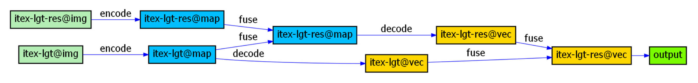
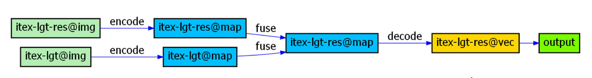

# Face Forgery Detection by 3D Decomposition and Composition Search

## Introduction

With the development of deep learning, deep learning models have become far more capable than humans in areas such as digital forgery detection. Many forgery samples that cannot be detected by the human eye can be accurately inferred and classified by the models. It is natural to think about extracting the visual clues and inferences used by deep learning models to guide the identification of unknown forgeries. However, the black-box characteristics of deep learning models lead to the fact that this knowledge is encoded in the weights of the neural network that cannot be parsed, which limits the possibility of knowledge transfer. The interpretable knowledge in the attention graph obtained from the visualization operation is very limited.

Our approach is motivated by the hope that the network discovers knowledge during training, and that this knowledge can be extracted to guide humans in designing neural networks. Guided by this idea, we propose a more general Composition Search (CS) strategy that transfers components-based tasks to a graph and employs NAS to find the best route from components to real/fake label, wherein useful components and effective feature extraction architectures are automatically found. We have first applied the method to the components-based task of face forgery detection with good results, and successfully found that facial identity texture and lighting contain the most forgery clues.After that we will subsequently support other components-based tasks.

Specifically, we use inference graphs to facilitate the extraction of this important knowledge. Since the nodes and edges of the inference graph are interpretable, the optimal path can be used directly as knowledge to reveal the visual clues and levels of inference learned by models. In order to apply this method to face forgery detection, we decompose a face image into four components: 3D shape, lighting, common texture, and identity texture under the Lambertian assumption. The decomposed components provide a set of CG descriptors for faces, which should be further correlated with the real/fake label. 

In our previous work, a network is manually designed to extract features from the fusion of lighting and identity texture, which is not ensured to be optimal. In this work, the selecting and correlating of components are modelled by a graph, following a representation mapping: 1) Each component is a node. 2) Each component can be encoded to a higher-level representation by convolutions. Thus, a new node can be generated and linked by a previous node by an encoding edge. 3) Multiple components can be fused to a component combination to model their correlations. Consequently, a new node can be generated and linked by multiple nodes through fusion edges. 

Based on this representation mapping, we can build the search space. A simplified search space with only three components: identity texture, lighting, and residual is built as:

<div align=center></div>

This graph clearly relates our task with the Neural Network Search (NAS) technique. According to our search strategy, the searched result from the search space are shown below:

<div align=center></div>

If we incorporate the computation penalty, a smaller searched result can be obtained:

<div align=center></div>


## Code

## Citation
If you find this project useful in your research, please consider cite:
```
@article{zhu2023face,
  title={Face Forgery Detection by 3D Decomposition and Composition Search},
  author={Zhu, Xiangyu and Fei, Hongyan and Zhang, Bin and Zhang, Tianshuo and Zhang, Xiaoyu and Li, Stan Z and Lei, Zhen},
  journal={IEEE Transactions on Pattern Analysis and Machine Intelligence},
  year={2023},
  publisher={IEEE}
}
```
